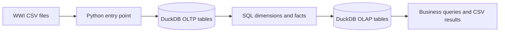
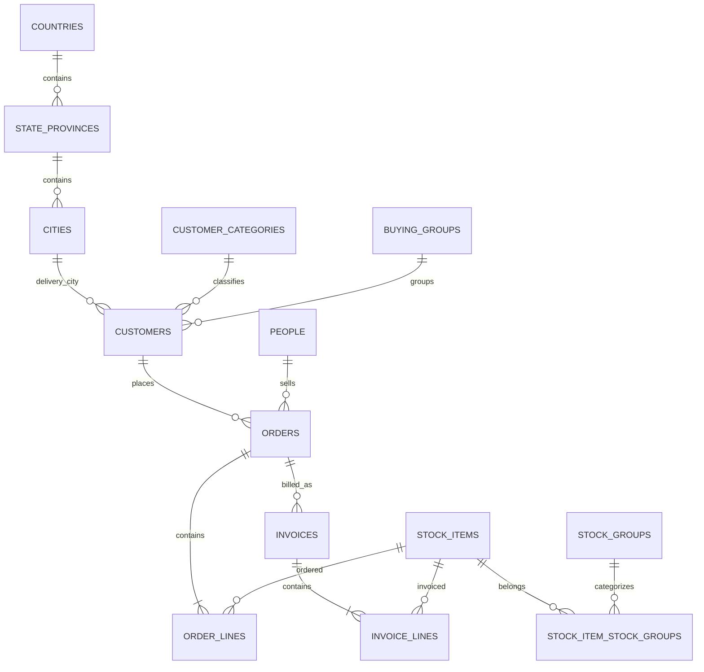
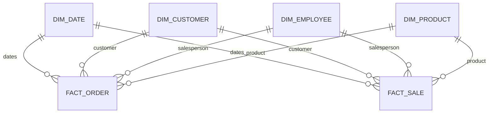

# WWI Sales Case Study

A small DuckDB pipeline that loads the WWI sales CSVs, builds a simple reporting
model, and saves answers to the ten business questions. The model intentionally
keeps only the tables needed for sales analysis.

## Run it

Prerequisites: Python 3.13 and DuckDB (`pip install duckdb`). From this folder:

```powershell
python scripts\run_pipeline.py
```

Place the extracted WWI files under `archive\` using the original folders
(`Application`, `Sales`, and `Warehouse`). The script checks that its required
CSV files exist. Each run recreates `data\wwi_case_study.duckdb` from the CSVs
and writes business-query results to `results\`.

## Model

The flow is:

```text
WWI CSVs -> oltp source tables -> olap dimensions and facts -> query results
```

### Source table mapping

| OLTP table(s) | Source CSV |
|---|---|
| `countries`, `state_provinces`, `cities` | `Application.Countries`, `Application.StateProvinces`, `Application.Cities` |
| `people` | `Application.People` |
| `customer_categories`, `buying_groups`, `customers` | `Sales.CustomerCategories`, `Sales.BuyingGroups`, `Sales.Customers` |
| `orders`, `order_backorders`, `order_lines` | `Sales.Orders`, `Sales.OrderLines` |
| `invoices`, `invoice_lines` | `Sales.Invoices`, `Sales.InvoiceLines` |
| `colors`, `stock_items`, `stock_groups`, `stock_item_stock_groups` | `Warehouse.Colors`, `Warehouse.StockItems`, `Warehouse.StockGroups`, `Warehouse.StockItemStockGroups` |

### Dimensions and fact grains

| Table | Meaning / grain |
|---|---|
| `dim_date` | One row per calendar date; includes the November-start fiscal year. |
| `dim_customer` | One row per customer version, including category and delivery geography. |
| `dim_employee` | One row per salesperson. |
| `dim_product` | One row per product; each product is assigned its lowest-ID source stock group. |
| `fact_order` | One row per source order line. |
| `fact_sale` | One row per source invoice line. |

Use `fact_sale` for invoiced sales, quantity, and profit. Use `fact_order` for
ordered quantities and backorder analysis. They are separate because an order
line and an invoice line are different events and have different dates.

### Customer history

Customer history uses SCD Type 2 for category changes: the old version is kept
with an end date and a new version is inserted with a new key. The demo changes
customer 1 from **Novelty Shop** to **Wholesaler** on 2015-01-01. This is a
synthetic second snapshot for the exercise; it does not alter the source CSV.
Facts use the customer version valid on the order or invoice date.

Other descriptive attributes are Type 1 in this small exercise; no history is
kept for them.

### Repeatability and checks

The single entry point rebuilds the generated DuckDB file on each run. This
avoids stale catalog dependencies and duplicate fact rows. It never changes the
source CSVs. The pipeline checks fact row counts against source line counts,
one current row per customer, valid SCD date ranges, and that transactions
resolve to both demonstrated customer versions.

The output log is `results\pipeline_log.txt`. Query results are saved as
`results\business_q01.csv` through `business_q10.csv`; the SQL is in
`sql\06_business_questions.sql`. The run checks fact counts, unique fact IDs,
fact-to-dimension matches, valid quantities and amounts, invoice/order date
order, and customer SCD current-row and effective-date rules.

## Business-question notes

- The invoiced-quantity percentage matches invoice lines to order lines by
  order and product because invoice lines do not identify a specific order line.
- The source's `IsUndersupplyBackordered` flag is true on every source order,
  so the analysis uses the explicit `BackorderOrderID` relationship instead.
  The linked backorder order value is an estimate of business impact, not
  unfilled value.
- A product can map to more than one source stock group. To keep category
  reporting simple, it is assigned to the lowest-ID group only.
- Sales before tax are calculated as `ExtendedPrice - TaxAmount`; profit is
  taken from the source `LineProfit`.

## Solution questions

1. **Why this stack?** DuckDB runs locally as one file, Python provides one
   understandable entry point, and SQL makes the table mappings and analysis
   visible without a server or orchestration framework.
2. **How was the model translated?** Source order lines become `fact_order`;
   source invoice lines become `fact_sale`. The dimensions describe date,
   customer/geography, salesperson, and product.
3. **Which attributes use SCD?** Customer category is Type 2 because the
   exercise needs an example of historical category changes. Other attributes
   are Type 1 for simplicity.
4. **How are duplicates avoided?** Each run starts from a fresh generated
   database and reloads from source, rather than appending to previous facts.
5. **What changes at millions of rows per day?** Use incremental ingestion and
   partitioned warehouse storage, orchestrate scheduled hourly batches, and
   monitor retries/late data. Keep the same business grains and add a database
   engine suited to the required concurrency and scale.

## Diagrams

### Pipeline



### OLTP relationships



### Reporting model



## Sources

- CSV dataset: [Wide World Importers CSV dataset on Kaggle](https://www.kaggle.com/datasets/pauloviniciusornelas/wwimporters). The downloaded files are treated as source extracts and are not modified by this pipeline.
- Business and sample-database overview: [Microsoft Learn — Wide World Importers](https://learn.microsoft.com/en-us/sql/samples/wide-world-importers-what-is?view=sql-server-ver17).
- Normalized source schema reference: [Microsoft Learn — OLTP database catalog](https://learn.microsoft.com/en-us/sql/samples/wide-world-importers-oltp-database-catalog?view=sql-server-ver17).
- Dimensional model reference: [Microsoft Learn — OLAP database catalog](https://learn.microsoft.com/en-us/sql/samples/wide-world-importers-dw-database-catalog?view=sql-server-ver17).
